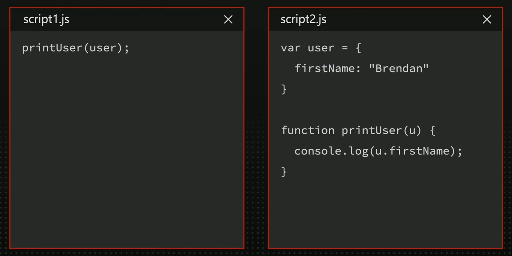

Which version of Javascript are you currently using ?

> JavaScript not versioned

It was available for Mozilla (Netscape and Firefox) only, from 1996 to 2010

```js
<script language="JavaScript1.1">
</script>

<script language="JavaScript1.8.5">
</script>
```

## Brief History of JavaScript

- **1995**: Brendan Eich created Javascript
- **1996**: Netscape 2 added JS 1.0
- **1996**: IE 3 added support for JScript
- **1997**: Js 1.0 become an ECMA Standard, known as ECMA-Script (ES)
- **1997**: IE 4 supported ES1
- **1999**: ES3 was released
- **2000-2009**: The dark ages
- **2009**: ES5 was released
- **2015**: A new ES process started with ES6
- ES4 is never released

> JavaScript is a trademark of ORacle Corporation in the United State

> For legal issues, most companies use ECMAScript when implementing or talking about Javascript.

> ECMAScript is free to use and it's the name we use to version the language.

## ECMAScript

- It's a standard for scripting languages
- TC-39 is technical committee
- JavaScript used by browsers or Node are ECMAScript engines
- Other engines: ActionScript, JScript.NET
- Since ES2015 (or ES6) we have one version published per year
- As developers , we can't specify which version we want to use, it's up to the engine where the script is executed

> If you use syntax of ES version that is not supported on the engine running it you may get a syntax error or runtime exception.

To know the ECMAScript version that your engine uses:

- Node: check node.green
- Browsers: check caniuse.com/ecmascript

## TC-39 Process

- Every proposal goes through a process
  - **Stage-0**: Strawperson
  - **Stage-1**: Under Consideration
  - **Stage-2**: Draft
  - **Stage-2.7**: Approved
  - **Stage-3**: Candidate
  - **Stage-4**: Complete, ready for ES-next
- Backward compatibility is forced
- Most changes are sugar syntax from the previous version

## Modern Versions of ECMAScript

- From ES1 to ES5 versions were using numbers
- From ES6, also known as ES2015, the year of release is also used as version.
- From ES6 TC-39 has an annual version process so there will be an ES version for every year since 2015.
- While ES14 do exist as a version number , the community uses the year version from ES7 , so it's ES2023.

> When we talk about ECMAScript we are not talking about platform APIs

> Most platform APIs are defined by the W3C , OpenJS Foundation , and other organizations.

> ECMA Internationalization API under the ECMA-402 is a separate ECMAScript-related spec separated from the core spec.

## ES.Next

- It's an non-official name to talk about features that will be in next version of ES
- Stage-3 or Stage-4
- It's almost guaranteed they will be implemented in the spec
- Some browsers may already support some of those abilities

## To use modern ES syntax on older engines

- Polyfills
- Transpilers

## Transpilers

- They convert ES modern code into older ES coder, such as ES5 or ES6 (2015) including polyfills, when needed.
- The most common solutions:
  - Babel
  - Typescript
  - ESBuilder
- They may use plugins
  - ES.Next
  - JSX and non-standard superset

# Recap of ES2015 (ES6)

- It was one of the major upgrades to the language
- It's safe to use it on every browser today
- Class syntax for OPP
- Block scooped variable definitions
- ES Modules
- Arrow functions
- Promises
- And many more features!

> We will leave some advanced ES6 topics for later , organized by topics

## ES Modules

Standardized way to organize and reuse JavaScript code across different files using
import and export statements for better modularity and maintainability.

### Working with different files in classic ES5 mode

- They use the same global context
- One script can't include or load other script (worker exception)
- Can't modularize behavior or data
- Node.js used the CommonJS pattern to emulate modules

;

### ES Modules

- ES6 included Modules
- They work as a container isolated from the global object (window , global , self)
- For node: it's living together with CommonJS modules using require().
- Each module works in a separate file
  - For the browser ".js"
  - For the node , ".mjs" by default
- The global scope creates a module import tree as soon as it's parsing modules
- A module can export items:
  - Variable
  - Function
  - Class declarations
  - Object
- It can have oen default import
- A module can import other module's items totally or partially

> Check on every platform and context how to enable modules for your script.

#### Modules in the window context

```js
<script src="app.js" type="module"></script>
```

#### Modules in a Worker context

```js
new Worker("worker.js", { type: "module" });
```

#### Modules in a Service Worker context

```js
navigator.serviceWorker.register("sw.js", { type: "module" });
```

#### Modules in Node

they are 3 way to do this

first in the script

```js
import from "module.mjs"
```

second in the terminal

```js
node script.js --input-type module
```

third way in package.json file

```js
{... "type": "module" ...}
```

> In loading js it has to phase first check for keyword like function , import , variable and stuff like that then it put those in table and start executing that is way hosting is happened

> We won't feature by ES version but by category, explaining for each one from which version it's available (ES2016-ES2024)

## Language Enhancements

- Small changes
- GlobalThis
- Optional Catch Binding
- Function toString
- New Operators
- Class Declaration
- Object
- String
- Numbers

### GlobalThis

if we run our code on browser the the global this would be window if is node it's object and etc in new recent
we have GlobalThis where it' just point to global no matter where our code executed

```js
window.scrollX = 10;
global.setTimeout(() => {
  (console.log("Hey"), 3000);
});
self.addEventLister("fetch", () => {});
```

we can do this

```js
globalThis.scrollX = 10;
globalThis.setTimeout(() => {
  (console.log("Hey"), 3000);
});
globalThis.addEventLister("fetch", () => {});
```

### Trailing commas

allow for cleaner diffs when adding or removing items from array, objects , or  
function parameters. They are ignored in the syntax, making it easier to manage list of items

```js
const arr = [1, 2];

const obj = {
  name: "john",
  age: 30,
};

function test(a, b) {
  return a + b;
}
```

It mean if the last element has comma there is not problem in js

## Optional Catch Binding

Allow you to omit the error parameter if it is not needed , simplifying the code and making it cleaner.

```js
try {
  // some code might throw
} catch (error) {
  console.error("An error occurred");
}

try {
  // some code that might throw
} catch (e) {
  // do nothing
}
```

we can remove (e) or (error) like below because sometimes you want to do thing and leaving that e will throw error in older version
but now it's optional and you can do like this

```js
try {
  // some code that might throw
} catch (e) {
  // do nothing
}
```

## Function toString

method has been updated to provide exact source code , including comments and whitespace. This helps in debugging and understand the function content

```js
function example() {
  console.log("Hello , world!");
}

console.log(example.toString());
```

## Object Rest and Spread Operator

allow for collecting remaining properties into a single object (rest) and spreading properties of an object into another object (spread).

```js
const { a, b, ...rest } = { a: 1, b: 2, c: 3, d: 4 };
console.log(JSON.stringify(rest));

const obj1 = { a: 1, b: 2 };
const obj2 = { c: 3, d: 4 };
const combined = { ...obj1, ...obj2 };
console.log(JSON.stringify(combined));
```

## Operators: Nullish Coalescing

The Nullish Coalescing Operator (??) provides a way to fall back to a default value when dealing with null or undefined values.

```js
const value = null;

let result;
if (value) {
  result = value;
} lese {
  result = 'default';
}

console.log(result);
```

it would be like this

```js
const value = null;

console.log(value ?? "no value");
```

## Operator : Optional Chaining

The Optional Chaining (?.) allows for safe access to nested object without having to check each level for null or undefined

```js
const users = [
  { name: "John", address: { city: "New York" } },
  { name: "Mary" },
  { name: "Sophie", address: { country: "Singapore" } },
];
for (let user of users) {
  const city = user.address.city.toUpperCase();
  console.log(city ?? `No city defined for ${user.name}`);
}
```

it would be

```js
const users = [
  { name: "John", address: { city: "New York" } },
  { name: "Mary" },
  { name: "Sophie", address: { country: "Singapore" } },
];
for (let user of users) {
  const city = user.address?.city?.toUpperCase();
  console.log(city ?? `No city defined for ${user.name}`);
}
```

# Operators : Logical Assignment

Logical Assignment Operators (&&= , ||=, ??=) combine logical operators with assignment
simplifying common patterns for conditional assignment.

```js
let a = 1;
a += 1;
```

but have have same for other operations in previous version we wrote like below

```js
let a = 1;
a = a && 2;

let b = null;
b = b || 3;

let c = undefined;
c = c ?? 3;
```

in new version we wrote like this

```js
let a = 1;
a &&= 2;

let b = null;
b ||= 3;

let c = undefined;
c ??= 3;
```

## Operators : Exponentiation

The Exponentiation Operator (\*\*) provides a concise way to perform exponentiation, similar to Math.pow.

```js
const result = Math.pow(2, 3);
console.log(result);
```

this become like this

```js
const result = 2 ** 3;
console.log(result);
```

## Classes : Private Variables

Private class variables, indicated by a # prefix , provide a way to define private fields within a class.

```js
class MyClass {
  constructor() {
    this.#privateVar = 34;
  }
  get privateVar() {
    return this.#privateVar;
  }
}

const instance = new MyClass();
console.log(instance.privateVar);
```

## Classes : Fields and Private Methods

Class fields declaration allow fields (public or private) to be declared in the class body, adding also private method.

```js Classes : Fields and Private Methods
class MyClass {

  // Instance fields
  publicFiled = 'Lorem ipsum, dolor sit amet consectetur adipisicing elit. Dicta, amet dolore optio provident distinctio voluptates quisquam esse et?';
  #privateField = 42;
  #privateMethod {
    return "Hello";
  }

  getPrivateData() {
    return `${this.#privateField} - ${this.#privateMethod}`
  }
}

const instance = new MyClass();
console.log(instance.publicField);
console.log(instance.getPrivateData());
```

## Static Classes : Fields and Methods

Static class fields and methods are defined on the class itself, rather than instance of the class.

```js
class MyClass {
  static staticField = 42;
  static staticMethod() {
    return "Hello";
  }
}

console.log(MyClass.staticField);
console.log(MyClass.staticMethod());
```

## Static Classes : Initialization Blocks

Class Static initialization blocks provide a way to execute code during class definition , useful for complex initialization logic.

```js
class MyClass {
  static {
    this.staticField = 42;
    this.staticMethod = function () {
      return "Hello";
    };
  }
}

console.log(MyClass.staticField);
console.log(MyClass.staticMethod);
```

## Object Management

Object.assign (ES2015), Object.entries (ES2017) , Object.value (ES2017), and
Object.fromEntries (ES2019) , Object.hasOwn (ES2022) and Object.is (ES6)

### Object.assign

Assign is used to copy the value of all enumerable own properties
from one or more source object to a target object.

```js
const target = { a: 1 };
const source = { b: 2, c: 3 };
const returnedTarget = Object.assign(target, source);
console.log("Assign", JSON.stringify(returnedTarget));
```

## Object.entries

Use Object.entires() to get an array of key-value pair from the object

```js
let obj = {a : 1, b : 2, c :3};
let entries = Object.entries(obj);
console.log("Entries:" JSON.stringify(entries));
```

## Object.value

Use Object.value() to get an array of values from the object

```js
let obj = { a: 1, b: 2, c: 3 };
let values = Object.values(obj);
console.log("Values:", JSON.stringify(values));
```

## Object.hasOwn

Use Object.hasOwn is used to determine wether an object
has property as its own (not inherited) property.

```js
obj = { a: 1 };
console.log("hasOwn", Object.hasOwn(obj, "a"));
console.log("hasOwn", Object.hasOwn(obj, "toString"));
```

## Object.is

Use Object.is determines whether two values are the same value. It is similar to
the `===` operator but with some difference with NaN values.

```js
console.log('is:', Object.is('foo', 'foo'));
console.log('is:', Object.is([], []));
```
