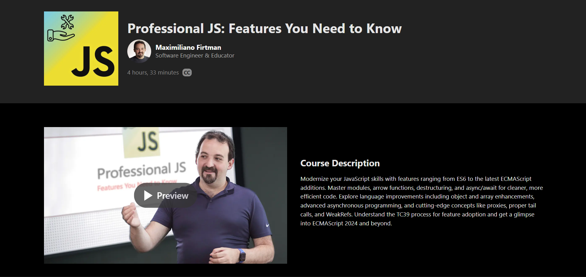

# Professional JS: Features You Need to Know

This repository documents my learnings from **Professional JS: Features You Need to Know** on Frontend Masters, taught by **Maximiliano Firtman** (Software Engineer & Educator).

📅 **Course Timeline**

- Started: April 7, 2026
- Completed: April 11, 2026

## About the Course

A deep dive into **modern JavaScript features** spanning from ES6 to the latest ECMAScript additions. The course covers the language enhancements that transform messy, verbose code into clean, efficient, and maintainable JavaScript.

Unlike traditional JavaScript tutorials that focus on frameworks, this course focuses on the **language itself**—understanding how JavaScript has evolved, what features are available now, and what's coming next. It bridges the gap between "knowing JavaScript" and writing professional, modern JavaScript with confidence.

Key topics include:

- 📜 **JavaScript History & TC39 Process**: Understanding how the language evolves, version naming, and the 4-stage proposal process for new features
- 🧩 **ES Modules**: Working with `import`/`export`, module execution order, singleton behavior, and enabling modules across browsers and Node.js
- 📦 **Block Scoping**: Mastering `var`, `let`, and `const` with proper understanding of global, function, and block scope
- 🏗️ **Class Syntax**: Constructors, getters/setters, subclassing, and modern class features
- 🎯 **Arrow Functions**: Shorter syntax, implicit returns, and critical differences in `this` binding and the `arguments` object
- 🔧 **Enhanced Object Literals**: Property shorthand, method definitions, and computed property names with dynamic expressions
- 🌀 **Rest & Spread Operators**: Collecting arguments into arrays and spreading array/object contents (including object spread for ES2018+)
- 📦 **Destructuring**: Extracting values from objects and arrays, including function parameter destructuring
- ⚡ **Nullish Coalescing (`??`)**: Safe default values that distinguish `null`/`undefined` from falsy values like `0` or `""`
- 🔗 **Optional Chaining (`?.`)**: Safe property access through nested objects without verbose conditionals
- 🔒 **Private Properties & Methods**: Using `#` for truly private class members (ES2022+)
- 📊 **Array & Collection Methods**: `includes`, `flat`, `find`, `at()`, stable `sort()`, `toSorted()`, `toReversed()` (change-by-copy)
- ⏳ **Asynchronous Programming**: Promises, `async`/`await`, `Promise.allSettled()`, `Promise.any()`, `finally()`, and top-level `await`
- ♻️ **Advanced Techniques**: Proxies & Reflect API, Symbols, `WeakRefs`, `FinalizationRegistry`, proper tail calls, and tagged templates
- 🔢 **New Data Types**: `BigInt` for large integers beyond `MAX_SAFE_INTEGER`
- 📝 **String Enhancements**: `startsWith`, `endsWith`, `includes`, `repeat`, `padStart`/`padEnd`, `trimStart`/`trimEnd`, and `matchAll`
- 🔍 **Regular Expression Upgrades**: Lookbehind assertions, named capture groups, the `/d` flag, and Unicode property escapes

Throughout the course, practical examples demonstrate each feature in action, comparing old vs. new approaches and highlighting real-world use cases for professional JavaScript development.

## 🚀 Why I Took This Course

I took this course to **sharpen my JavaScript skills** and understand the advanced and modern features of the language. I wanted to move beyond basic syntax and write cleaner, more efficient code using the full power of ES6 and beyond.

## 📢 Access Note

Due to regional restrictions in Iran, I accessed this course through alternative means. While I don't have an official certificate, I completed the lessons, followed the demonstrations, and documented my implementations and takeaways in this repository.